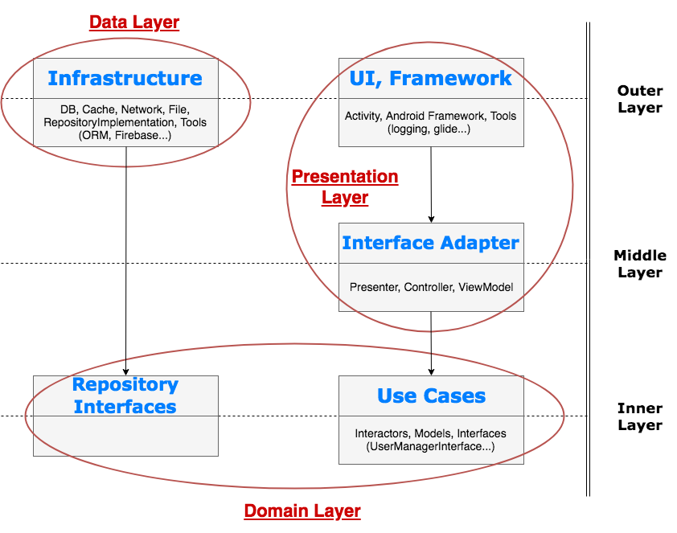

Breaking Bad is an American neo-Western crime drama television series created and produced by Vince Gilligan. 
The show aired on AMC from January 20, 2008, to September 29, 2013, consisting of five seasons for a total of 62 episodes

This app shows a list of characters, over the 5 seasons. On click of the character, will display further information.

A simple Android app that demonstrates clean code architecture. 

The app should have two screens, as follows:

Screen 1 should contain a list of characters. Tapping on a cell in the list, should take you to the second
screen.

Screen 2 is the detail screen for the selected character. Details to be shown about each character are:
- name
- occupation
- status
- nickname
- season appearances

You get all the data you want from the following API endpoints:
- GET https://breakingbadapi.com/api/characters

Layers:

1. Data
2. Domain
3. Presentation

Data Layer
- Network Layer  : consists of the retrofit api service interface, mappers to convert network Dtos to domain model, and the Dto network model file.
- Di : consists of : URL module, to allow hilt's DI dependency to swap modules, for easily testing, replacing the url, with localhost, for Mock servers, like MockWebServer. NetworkModule, RepositoryModule and RoomModule.
- Room Layer: Consists of 3 layers: DB layer which contains the Dao and Database files, Mappers, conversion between Domain model and Room Entity models, and the model layer with the Entity file.
- Repository : consists of the interface Repository, and its implementation MainRepository.

Domain Layer
- Domain Model.

Presentation Layer
- app : consists of BreakingBadCharacterApplication, which initialises the Hilt Dagger dependency graph.
- datastate : dealing with loading state, etc
- ui : consists of the ui files, activities, recycler adapter, decorator. etc.
- utils : extension files, color extension file used to quickly add html style formatting to textviews easily.
- viewmodel : the main activity viewmodel 
 
Testing

Unit Tests:

Data Layer

Network:

NetworkMapperTest 
100% coverage, to ensure all mappings are correct between the Network and Domain layers.

MainRepositoryTest
Tests:
1. test repo gets list of characters
2. test repo error state on api error

Room
CacheMapperTest
100% coverage, to ensure all mappings are correct between the Room and Domain layers.

Presentation

Instrumentation Tests

MainActivity
1. Test #1 : testing recyclerview comes into view
2. Test #2 : testing select item, right data in view
3. Test #3 : testing select item, select back, recyclerview comes back into view

DetailedActivity
1. Test for correct display of Name
2. Test for correct display of Occupation
3. Test for correct display of Status
4. Test for correct display of NickName
5. Test for correct display of Season Appearance

Description:
1. Uses clean-code architecture: Domain/Data/Presentation layers, as shown in the above diagram. 
2. Domain layer has a model, BBCharacter. The Data network layer has its own model : Dto, and the cache/room has an Entity Model. This way we eliminate the propogation of model dependencies thoroughout our app, so that those main areas where we model data, are kept separate. 
3. Uses Coroutine flows with built-in scoping that provide structured concurrency, eg ViewModelScope.
4. Adds some html functionality, eg color, bold, etc, to TextViews to easily add basic formatting to the Views, eg used in the Detailed Actviity to make the Text easier to read without adding much complexity or without the use of any large libraries
5. Hilt which is a Google DI library that sits on top of Dagger 2 is used.
6. It shows how we can combine coroutines with LiveData to effectively achieve good uni-directional flow and clean-code practises.
7. It uses the semi-capability of room with inheritance. It uses a BaseDao , that can be used with multiple Dao classes, allowing reuse of functionality.
8. Uses searchView within the mainActivity and use the SearchWidget to the ActionBar for your search. It is specifically designed for the Android platform, and as such, usually the recommended approach, it will give you extra context features, like search icons inside the virtual keyboard.
9. It is a good practice to separate the URL dependency, as I have done, by injecting it, using UrlModule. This way, Hilt, provides an easier mechanism, than DAgger, to provide testing dependencies, by, swapping ( uninstalling and adding local test modules , in our case, the UrlModule could provide the localhost url for a Mocking Web Server).

TODO:
1. Add the Mocking Web Server to the tests. Since, the data is static, we don't need a mocking web server, but, if it was dynamic, then testing the UI might be more difficult, and a mocking web server would be required. Although, Mocking Web Server gives us extra benefits, eg mocking http responses. 
2. Add use cases. I didn't use use cases, in this particular example, because I have used them several times, before, please look at Posts ( https://github.com/ihajat/Posts ) where I use usecases, and WordCounter ( https://github.com/ihajat/WordCounter ) where I use interactors.
3. Uses ktlintFormat. See https://github.com/shyiko/ktlint for more information, but, to summarise, fix all style violations automatically by running a gradle task; so , you get a lot of formatting within minutes.
4. Demonstrate the use of several adapter-free libraries, open-source, out there, that will a) eliminate the need for an recycler adapter file b) get Rx to work with the Adapters. So, changes to checkboxes and searchViewes/editboxes will trigger automatic updates to the content of the recyclerview. For example, there are FastAdapter, LastAdapter, these two adapters offer multiple features. I have used LastAdapter before to easily refresh dynamic lists; as it uses an ObservableList, to achieve that. Here, because the data is static, but our filtering is dynamic, so we could either use the LaStAdapter with rxBinding, or, use another library called: RxRecyclerAdapter.
5. The UI uses checkboxes, as it allows for better UI experience than, for example, using TWO searchViews, one for the name, and the other for the season. Also,  the searchViews were NOT designed to have TWO or more in a single Activity. The complexity would NOT be recommended , eg you would need to add complex code to keep the UI simple, eg hiding and showing the search Icons, as well as, programmatically calling the hint , to differentiate what the search context was. However, we could use Material Design, to make the checkboxes more 'attractive', as the standard ones look quite unappealing. 
6. Write some tests for the Caching ( Room ), since they are suspend functions, we can use runBlockingTest, as we have done with the other unit tests.
7. Maybe Introduce you to a Google classic Design Pattern/Generic class, called, NetworkBoundResource. It's quite popular, and it provides a source of all truth , where we should acquire our data from , cache or network. It is a generic class, so, it will be the base class for all of OUR data that is retrieved from the network and stored locally in cache.   NetworkBoundResource is an abstract class, hence when you create object of it you’ll need to override the following methods:

loadFromDb() — Contains the logic to get data from database (Like Room)

createCall() — Contains the logic to get data from web-service

saveCallResult() — Here we save the data fetched from web-service

processResult() — To map the data between the result and request.

I have used it before, both in Java and Kotlin. Look at , the repo: https://github.com/ihajat/albums, for an example usage of it.

